# Fintech Banking App

[原文地址](https://dev.to/duomly/series/6782)

## 工具

- migrate: migration cli

  ```sh
  go install -tags 'postgres' github.com/golang-migrate/migrate/v4/cmd/migrate@latest
  ```

- sqlc: sql generate cli

  ```sh
  go get github.com/kyleconroy/sqlc/cmd/sqlc
  ```

- gomock: mock db

  ```sh
  go get github.com/golang/mock/mockgen
  ```

  ```sh
  vi ~/.zshrc
  ```

  文件内容：

  ```sh
  export PATH=$PATH:~/go/bin
  ```

  执行

  ```sh
  source ~/.zshrc
  which mockgen
  ```

  ```sh
  mockgen fintech-banking-app/db/sqlc Store
  ```

## 依赖

- pq: postgres driver

  ```sh
  go get -u github.com/lib/pq
  ```

- testify: test

  ```sh
  go get github.com/stretchr/testify
  ```

- gin: web framework

  ```sh
  go get github.com/gin-gonic/gin
  ```

- viper: env file

  ```sh
  go get github.com/spf13/viper
  ```

## 隔离等级与读取现象

1. 数据库事务的 ACID 属性：

   - `Atomicity` 原子性
   - `Consistency` 持续性
   - `Isolation` 隔离性：作为数据库事务属性的最高等级，用于确保所有的并发事务不会被互相影响
   - `Durability` 持久性

1. 4 种读取现象

   - `dirty read`：发生在当一个事务读取一些由其它并发事务所写的数据，并且还未被提交时。这很不好，因为我们不知道其它事务最终是否会提交或者回滚。因此我们可能会读取到错误的数据，当回滚出现时。
   - `non-repeatable read`：当一个事务读取相同的记录两次并发现不同的值，因为该行在第一次读取后被其它事务所修改了。
   - `phantom read`：与前者类似，影响的是查找多行而不是单行。这种情况下，相同的查询被重复执行后，返回的却是不同的行，这是因为其它的事务近期做了一些改变，例如插入新行或是删除已有行。
   - `serialization anomaly`：一组并发提交的事务，如果我们尝试以任何顺序运行并且它们之间没有重叠，它们不能被完成。

1. 4 种隔离等级

   - `read uncommitted`：最低等级的隔离。该等级下的事务可以看到其它事务的未被提交的数据，因此允许 `dirty read` 现象出现。
   - `read committed`：事务只能看到其它事务提交后的数据。因此 `dirty read` 不可能出现。
   - `repeatable read`：确保相同的查询请求将会返回同样的结果，无论它被执行了多少次，即使有其它的并发事务提交了新的改动。
   - `serializable`：最高等级的隔离。并发事务运行在这个等级被保证了：如果它们是以某种顺序运行并且之间没用重叠，那么返回的结果就是相同的。基本上就意味着存在至少一种方法来排序这些并发事务，使得它们的结果与一个接着一个的运行的结果相同。

1. 结论：

   - MySql 的 隔离性：
   - PostgreSql 的 隔离性：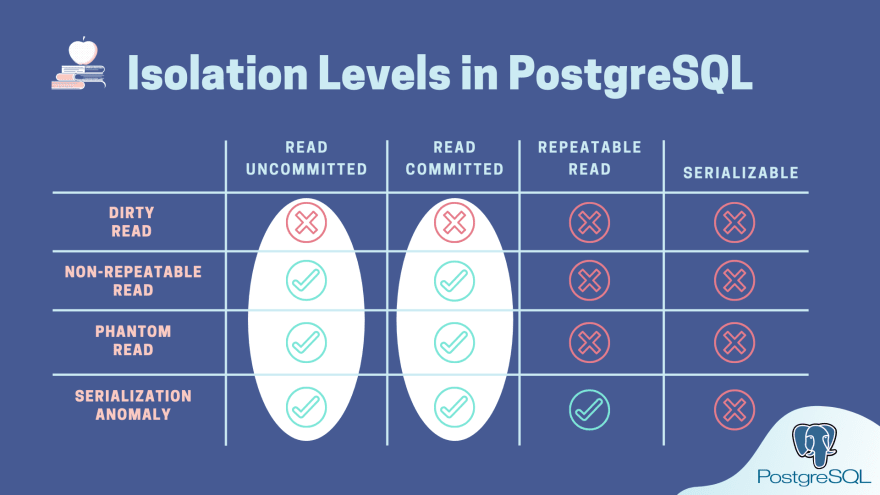
   - 两者间的比较：

1. 总结：需要记住的最重要的一点就是当使用高隔离等级可能会出现错误、超时、或者甚至死锁。因此我们需要小心的为我们的事务实现一个重试机制。另外不同的数据库引擎可能有不同的隔离等级实现。所以确保你小心的阅读文档，并在写代码之前独自尝试一下。

## 设置 Github Actions 使 Go + Postgres 运行自动测试

**Continuos integration (CI)**是软件开发过程中的一个重要部分，它集成了由团队合作所造成共享代码仓库中的持续性的改动。为了确保高质量的代码并且减少潜在错误，每个集成通常都会被自动构建和测试的工具所验证。

### Workflow

为了使用 Github Actions，我们需要定义一个工作流 workflow。它基本上是由一个或者多个工作而组成的一个自动化过程。它可以由以下三种方式触发：

- 通过一个 Github 仓库的事件
- 通过设定一个重复的时间表
- 通过 UI 手动点击


### Runner

为了运行任务，我们必须为每个任务都指定一个运行器 runner。一个 runner 就是一个监听可行任务的简单的服务，并且它每次只会运行一个任务。我们可以直接使用 Github 的 runner，或者指定你自己的 runner。


Runners 会运行任务，接着报告进程，日志以及返回的结果至 Github，这样我们便可以在 repo 的 UI 上轻松地查看。

### Job

一个任务 job 是一个将会被执行在同一个 runner 上的步骤的集合。通常所有在 workflow 的任务会并行执行，除非当你某些任务依赖于其它的任务，这时就会顺序运行。

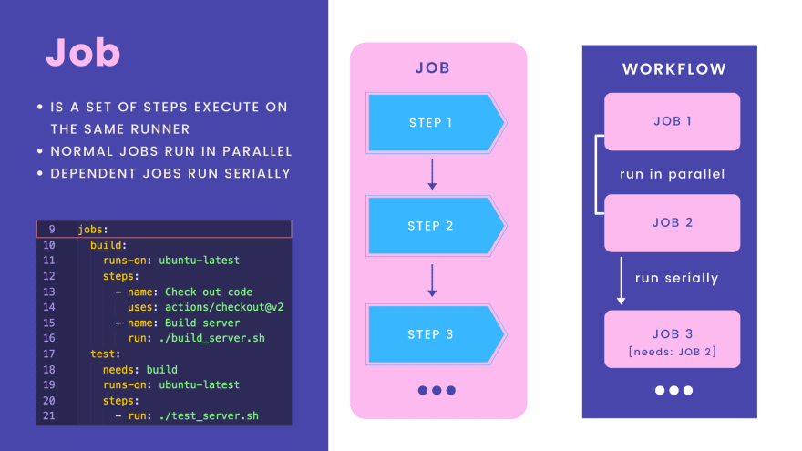

通过 `needs` 关键字告诉 `test` 任务是依赖于 `build` 任务的，这样就能在成功构建后再进行进行测试。

### Step

步骤 steps 是独立的顺序运行的任务 tasks，在一个 Job 中一个接着一个。一个 step 可以包含一个或者多个行动 actions。

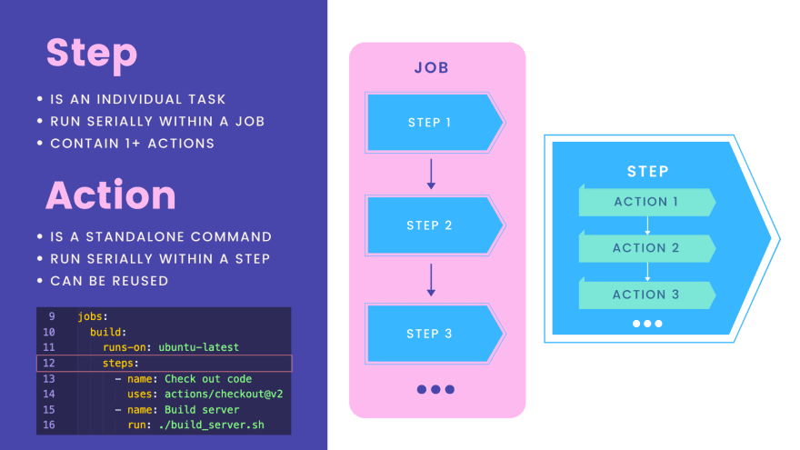

Action 基本上是一个独立的命令，像是一个 `test_server.sh` 的脚本。如果一个步骤中包含多个 actions，它们则会被顺序运行。

一个有趣的事情就是 action 是可以被重复使用的。因此如果某人已经编写了一个我们所需的 github action，我们实际上是可以将其使用于我们的工作流中。

### Summary


## Mock DB

使用 Mock DB 的几个原因：

- 首先，帮助我们可以更简单的编写出独立的测试，因为每个测试将会用到隔离的 mock DB 来存储数据，即消除了测试之间的相互影响。如果使用的是真实 DB，所有的测试都会在同一个地方读写数据，这样就很难避免冲突，特别是一个大的项目中携带者巨大的基础代码。
- 其次，测试将会更快的运行，因为它们不再需要花时间与 DB 沟通并等待回应。所有的行为将在内存与统一过程中被执行。
- 第三也是最重要的原因就是：它让我们编写 100% 覆盖率的测试。通过一个 mock DB，我们可以轻松的创造并测试一些边缘情况，例如一个意外的错误，或者一个连接失败，这些都是在使用真实 DB 情况中不能被达到的。

### 生成 Mock DB

`mockgen` 给予用户两种生成 mocks 的方式。`source mode` 将会从一个源文件生成 mock 接口。

当源文件引入了其它包的时候这将变得更复杂，这也是我们在真实项目中会遇到的情况。

这种情况下，更好地办法是使用 `reflect mode`，即我们仅需提供包名称以及接口，便可以让 mockgen 自动使用反射。

执行：

```sh
mockgen fintech-banking-app/db/sqlc Store
```

第一个参数为 `Store` 接口的导入路径。第二个参数为接口的名称。

```sh
mockgen -destination db/mock/store.go fintech-banking-app/db/sqlc Store
```

使用 `-destination` 用于指定生成的文件。

生成的 `db/mock/store.go` 文件中有两个重要的结构体：`MockStore` 与 `MockStoreMockRecorder`。

前者实现了 `Store` 接口所需要的所有函数。后者可以指定函数被调用的次数，以及带有何种参数。

由于生成的 package 名称为 `mock_sqlc` 并不符合惯用法，加上 `-package` 可以自定义命名。

```sh
mockgen -package mockdb -destination db/mock/store.go fintech-banking-app/db/sqlc Store
```

## 如何存储密码

添加 `cost` 和 `salt` 用于生成最终的哈希字符串：

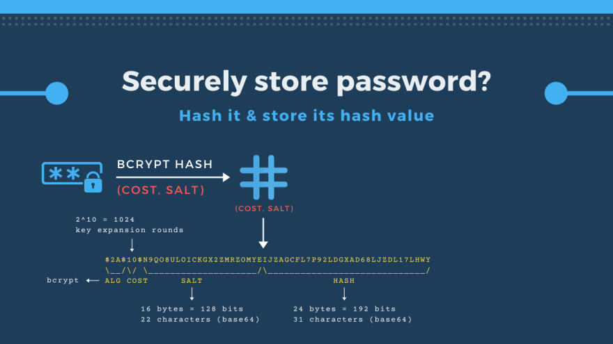

该哈希字符串由 4 个部分组成：

- 第一部分为 `hash algorithm identifier` 哈希算法标识。这里 `2A` 即 `bcrypt` 算法。
- 第二部分为 `cost`。本例中为 `10`，意味着将会有 `2^10 = 1024` 种钥匙解释。
- 第三部分为 `salt` 拥有 `16 bytes` 长度，或者 `128 bits`。它是由 `base64` 格式来进行编码，将会生成 `22` 个字符的字符串。
- 最后部分为 `24 bytes` 的哈希值，编码为 `31` 个字符。

这四部分会串联在一起形成一个哈希字符串，并最终将会在数据库中储存该哈希字符串。


如何验证用户输入的密码是正确的呢？首先我们通过 `username` 在数据库中找到 `hashed_password`。接着使用 `hashed_password` 中的 `cost` 和 `salt` 作为入参来哈希用户输入进 `bcrypt` 中的 `naked_password`。其输出结果将会变为另一个哈希值。接着比较这两个哈希值，如果一致，则密码正确。

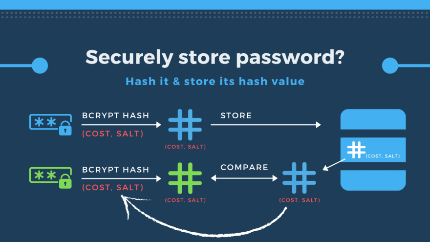

## PASETO

### 基于 Token 的身份验证

基本上在这一类的验证机制中，客户端将首先请求用户登录，其提供用户名以及密码至服务器。


服务器检查用户名和密码正确与否。如果正确，服务器将创建并分配一个带有私密或者私有钥匙的 token，然后带上 200 ok 的响应一并发送回客户端。

其称为 access token 的原因是因为之后客户端将会使用这个 token 来访问其它在服务器上的资源。


### JSON Web Token


JWT 是一个 base64 编码的字符串，由 3 个主要部分构成，它们之间以点号做分隔。

第一部分（红色）是 token 的 header。当我们解码这一部分，我们将会得到一个包含 token 类型 JWT 的 JSON 对象，以及用于标记 token 的算法：这个例子中为 HS256。

第二部分（紫色）是 token 荷载的数据 payload data。这一部分是用于存储用户的登录信息的，例如用户名以及 token 何时失效的时间戳。

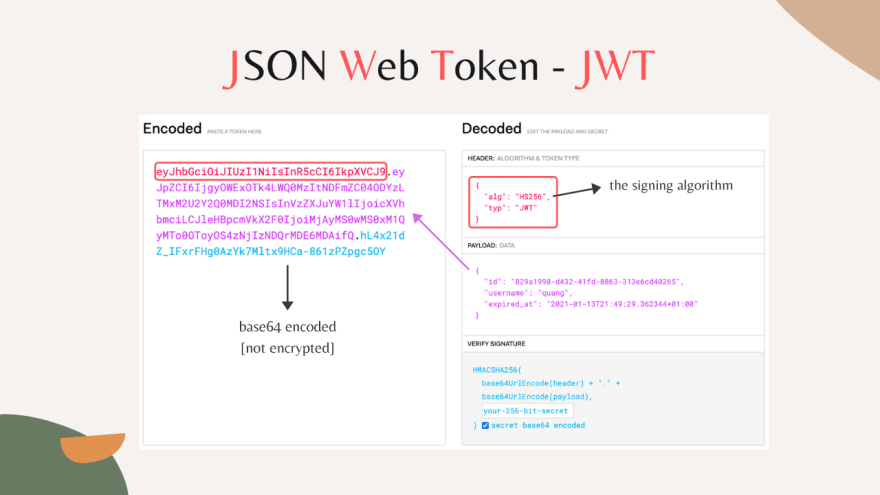

你可以自定义任何信息于存储的 JSON 荷载。这种情况下我们同样拥有一个唯一的 ID 字段来鉴别 token。当 token 被泄漏时我们便可以（通过唯一 ID）撤回 token 的访问。

注意所有的数据存储于 JWT 中的都是 base64 编码的，而不是加密的。因此你不需要服务器的秘密/私有钥匙来用于内容解码。

这也意味着我们可以在不适用 key 的情况下，轻易地编码 header 和 payload 数据。那么服务器如何验证 token 的真实性呢？

第三部分就是为了这个目的存在的：数字签名（蓝色）。道理很简单，仅需要服务器拥有密码/私有钥匙用于标记 token 即可。因此如果一个黑客尝试创建一个假的 token 而没有正确钥匙，它便轻易地会被服务器在验证的过程中发现。

JWT 标准提供了很多不同的数字签名算法类型，但是他们主要可以被分为两大类。

### 对称加密算法 Symmetric-key algorithm

第一类称为对称加密算法，其中相同的密匙用于标记和验证 tokens。

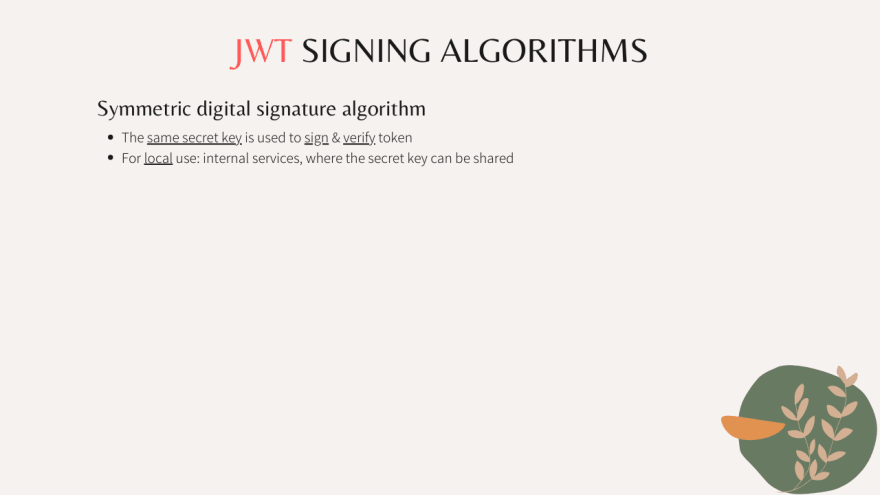

由于只有一个密匙，因此需要对密匙进行保密。因此该算法仅适用于本地使用，或者换句话说，适用于服务内部之间，因为保密的密匙是可被共享的。


对称加密算法非常高效，并且适用于大多数应用。

然而在外部第三方服务希望验证 token 的情况下我们不能就使用这个方法了，因为这意味着我们必须将秘钥交出去。

这种情况下，我们必须使用第二种方法：非对称加密算法。

### 非对称加密算法 Asymmetric-key algorithm

该类型算法拥有一对密匙而不是一个密匙。


私有密匙用作于标记 token，而共有密匙仅用于验证 token。

这样我们就可以轻松的将共有密匙共享给任何第三方服务而不用担心泄露私有密匙。

在非对称加密算法中，有若干组算法，例如 `RS` 组，`PS` 组，或者 `ES` 组。

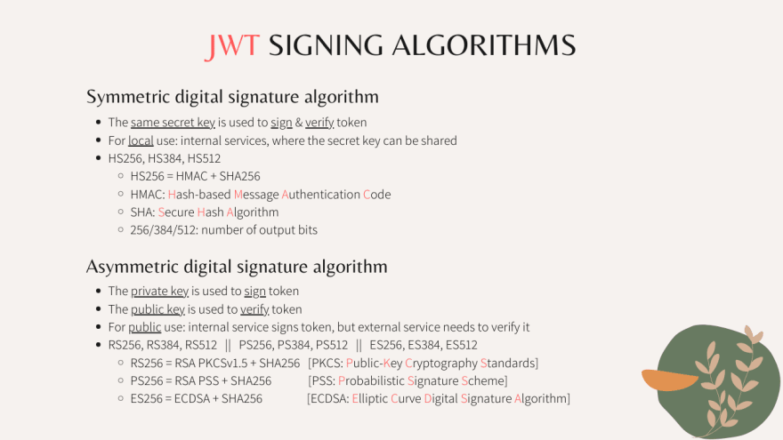

### JWT 的问题

#### 弱算法


对于开发者而言没有深厚的安全相关经验，选择最好的算法来使用是很困难的。

因此事实就是在选择算法上，JWT 提供给开发者太高的灵活性，就像是给了一把枪射在自己脚上。

#### 易伪造

这还不是最糟糕的。JWT 太容易被伪造，如果你的实现不够谨慎，或者你的项目中选择了较差的实现，你的系统很容易称为一个脆弱的目标。

JWT 的一个缺点是 token header 中包含了标记算法。正因如此，我们过去见到过一个攻击者仅需设定 `alg` header 为 `none` 来绕过签名验证的过程。

当然这个问题已经被识别了，并且在很多库中修复了，但是这也是在为你的项目选择社区库时，你需要小心检查的一项事务。


另一个更为危险的潜在攻击是故意设置算法 header 成为一个对称密匙，例如 `HS256` 当已知服务实际使用的是一个非对称加密算法，例如 `RSA`。

基本而言，服务器的 RSA 公用密匙显然是公开的。因此黑客仅需要创造一个 admin 用户的假 token，故意设置算法 header 为 HS256，即对称加密算法。接着标记该 token 于服务器的公用密匙，并使用它访问服务器的资源。


注意服务器通常使用一个 RSA 算法，例如 RS256 用于标记与验证 token，因此将使用 RSA 公钥作为密匙来验证 token 签名。然而由于 token 的算法 header 指明了是 HS256，服务器将使用对称算法 HS256 而不是 RSA。因为同样的密匙也是黑客用来标记 token 的，这个签名验证的过程就会被通过，那么黑客的请求便会被授权。

这类型的攻击非常的简单，但是还是威力巨大并且危险的，这也是真实在过去发生的因为开发者在验证 token 签名之前，未检测算法 header。因此为了避免这类攻击，服务端的代码则非常的重要，你必须检查 token 的算法 header 来确保它可以匹配你服务所使用的 token。


好了现在我们知道了为什么 JWT 不是一个好的设计标准。它开了太多潜在威胁的后门。因此很多人在尝试远离它，并尝试使用一些鲁棒性更好的方案。

### PASETO - Platform Agnostic Security Token

PASETO，即平台无关的安全令牌 Platform Agnostic Security Token，是一个最成功的设计，它在社区中被广泛的接受，以及被视为最安全的安全令相比于 JWT。

#### 强算法

它首先解决了所有的 JWT 问题，提供了强算法。开发者不再需要选择算法，他们只需要选择某一个版本的 PASETO 来使用。


每个 PASETO 版本都由一套强力的密码学而实现。在任何时候只会保持最新的两个版本的 PASETO 处于激活状态。现在两个 PASETO 的版本是 1 和 2。

##### PASETO 版本 1

版本 1 较旧，仅可以被不能使用现代密码学的传统系统所使用。类似于 JWT，paseto12 同样拥有两个算法类别应对两种场景。本地或内部服务，我们使用一个对称算法。


不同于 JWT 仅用 base64 编码负载以及制定 token，PASETO 则是通过一个秘钥来加密以及认证所有的 token 中的数据，其使用的是一个带有关联数据（AEAD）算法的强认证密码。PASETO 版本 1 中所使用的 AEAD 算法是带有 HMAC SHA384 的 AES256 CTR。

而公共场景下，外部服务需要验证 token，我们需要使用一个非对称算法。这种场景下，PASETO 使用类似于 JWT 的方式，也就是说不对 token 数据加密，而仅用 base64 进行编码，并使用一个秘钥来制定数字签名的内容。


PASETO 版本 1 的非对称算法是带有 SHA384 的 RSA PSS。

##### PASETO 版本 2

PASETO 的最新版本号是 2，该版本更加的安全并且使用了现代算法。

本地的对称算法使用的是带有 Poly1305 的 XChacha20 的算法。


而公共场景下，使用的是带有 curve 25519 的 Edward-curve 数字签名算法。


#### 不易被伪造

PASETO 的设计使得伪造变为不可能。因为算法的 header 不再存在，因此攻击者不能设定其为 none，或是强迫服务器使用 header 中所提供的算法。

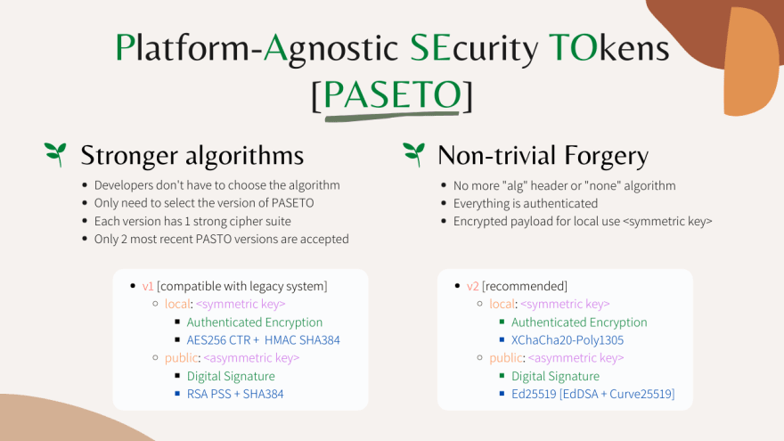

所有存在与 token 的也都被 AEAD 认证，因此不可能对其做手脚。此外如果你使用一个本地的对称算法，负载现在是被加密的，而不仅仅是被编码，因此它不可能被黑客读取，或是在不知道服务器秘钥时替换掉 token 中的数据。

现在让我们看一下 PASETO token 的结构。

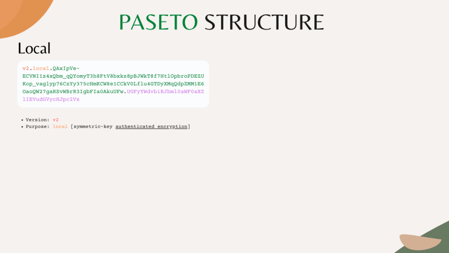

这是一个版本 2 的 PASETO token 用作于本地。它一共有 4 个主要部分，由点所分隔。

第一个部分是 PASETO 的版本（红色），即版本 2。

第二部分是 token 的目的，它是用作于 local 还是 public 场景？这个例子是 local，也就意味着使用一个对称秘钥验证的加密算法。

第三部分（绿色）是主体或者是 token 的负载数据。注意它是被加密的，所以如果我们通过秘钥解密它，我们将会的到 3 个小部分：

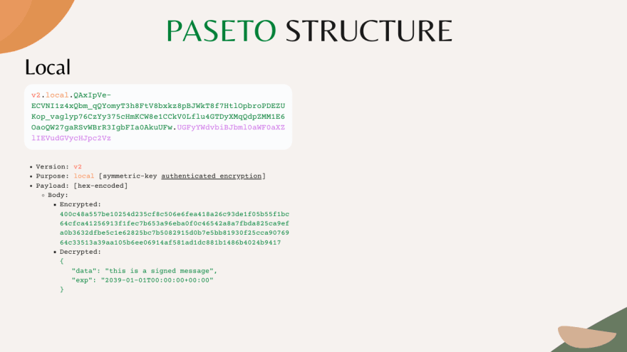

- 首先是负载主体。本例我们仅存储一个简单的信息，以及一个 token 的过期时间。
- 其次，在加密和消息身份验证过程中都使用的 nonce 值。
- 最后使用消息认证标签对加密的消息及其关联的未加密数据进行认证。


本例中未被加密的数据是版本号，目的，以及 token 的注脚（紫色）。

你可以存储任何公共信息于注脚中，因为它不会像负载体那样被加密，而仅被 base64 编码。因此任何获取 token 的人可以解码并阅读注脚的数据。


本例中，是 Paragon Initiative Enterprises，即发明 PASETO 的企业。

注意注脚是可选的，因此你可以拥有一个 PASETO token 而不需要注脚。例如以下是另一个 PASETO token：


它仅有 3 个部分而没有注脚。你可以看到，绿色部分的负载是实际的被编码体，它可以简单的被解码并获得 JSON 对象。

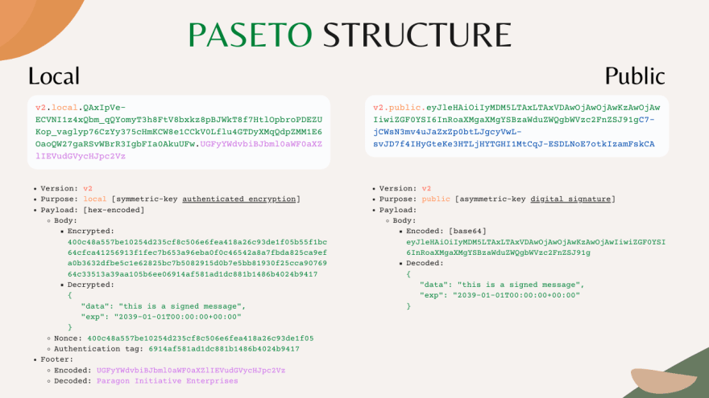

而蓝色部分的负载是 token 的签名，是由带有秘钥的数字签名算法而生成的。服务器将使用匹配的公钥来验证该签名


